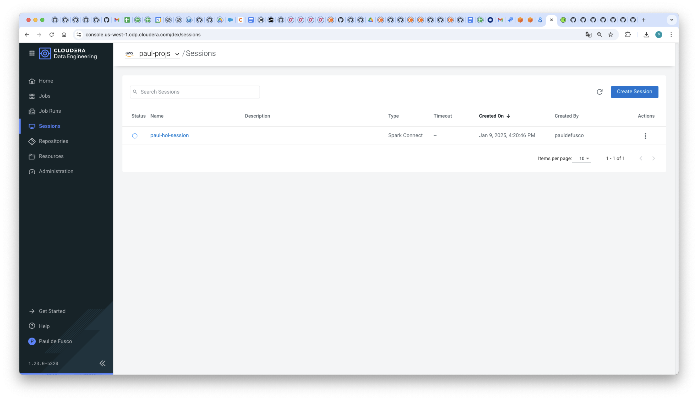
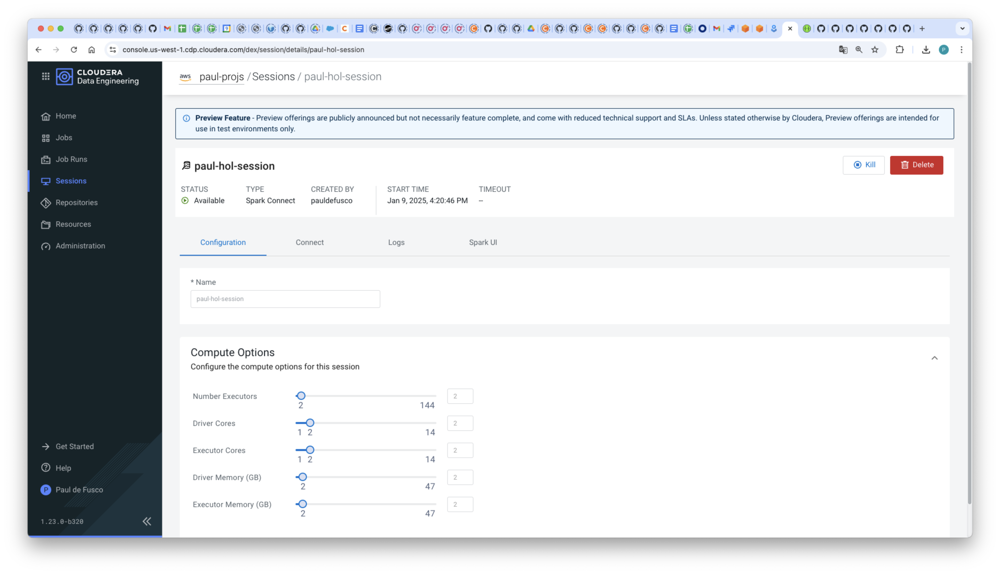
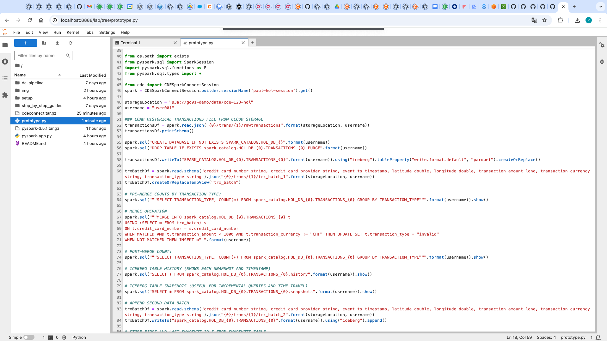
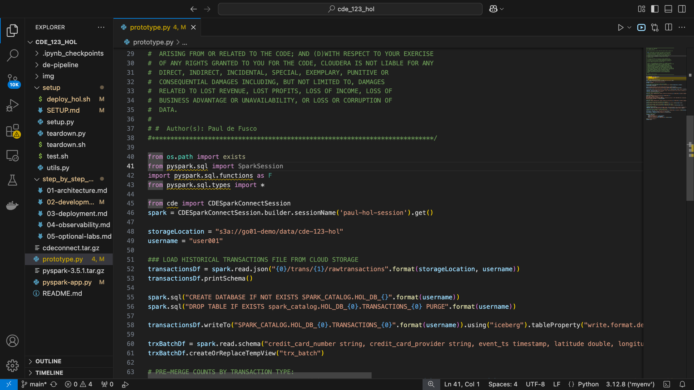
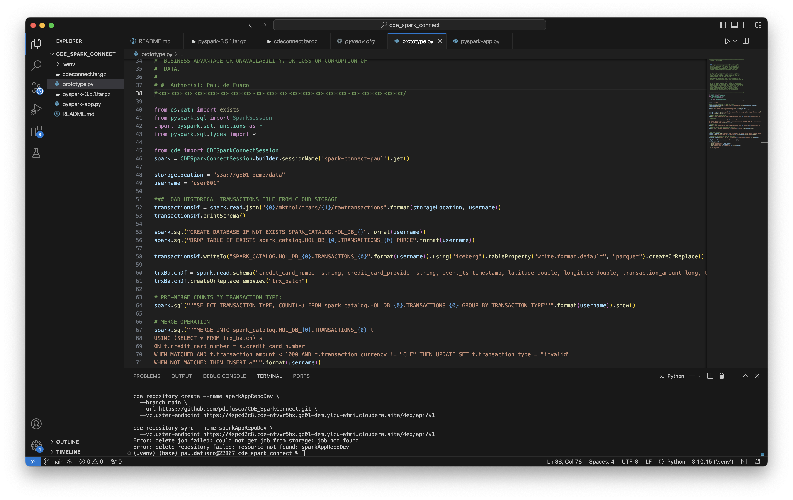

# Spark Application Development in CDE

## Contents

0. [PySpark & Iceberg Application code walkthrough]()
1. [Test jobs with Spark Connect from local](https://github.com/pdefusco/CDE_SparkConnect?tab=readme-ov-file#1-test-jobs-in-cde-session-from-local).  
2. [Once ready for operationalization push to git](https://github.com/pdefusco/CDE_SparkConnect?tab=readme-ov-file#2-push-to-git).
3. [Sync with CDE repository](https://github.com/pdefusco/CDE_SparkConnect?tab=readme-ov-file#3-sync-with-cde-repository)
4. [Deploy using CLI](https://github.com/pdefusco/CDE_SparkConnect?tab=readme-ov-file#4-deploy-using-cli)
5. [Monitor](https://github.com/pdefusco/CDE_SparkConnect?tab=readme-ov-file#5-monitor)

We will prototype and test the Iceberg Merge Into and Incremental Read Operations.

## Instructions

## 0. PySpark & Iceberg Application code walkthrough

## 1. Test jobs in CDE Session from local

#### Launch a CDE Spark Connect Session

Start a CDE Session of type Spark Connect. Edit the Session Name parameter so it doesn't collide with other users' sessions.

```
cde session create \
  --name paul-hol-session \
  --type spark-connect \
  --num-executors 2 \
  --driver-cores 2 \
  --driver-memory "2g" \
  --executor-cores 2 \
  --executor-memory "2g"
```

In the Sessions UI, validate the Session is Running.





#### Install Spark Connect Prerequisites

From the terminal, install the following Spark Connect prerequisites:

* Create a new Python Virtual Environment:

```
python -m venv cde-123-hol
source cde-123-hol/bin/activate
```

* Install the following packages:

```
pip install numpy==1.26.4
pip install --upgrade cmake
pip install pyarrow==14.0.0
pip install cdeconnect.tar.gz  
pip install pyspark-3.5.1.tar.gz
```

* If you intend to use VSCode, open it. If you intend to use JupyterLab, launch the server with:

```
jupyter lab
```






#### Run Your First PySpark & Iceberg Application via Spark Connect

You are now ready to connect to the CDE Session from your local IDE using Spark Connect.

Open "prototype.py" in your IDE (VSCode or JupyterLab). Make the following changes:

* At line 46, edit the "sessionName" parameter with your Session Name from the above CLI command.
* At line 48, edit the "storageLocation" parameter with the following: <Enter Cloud Storage Location Here>
* At line 49, edit the "username" parameter with your assigned username.

Now run "prototype.py" and observe outputs.



#### Prototype the Spark & Iceberg Application as a Spark Submit

On your terminal run the following commands. Make sure to edit the "vcluster-ednpoint" and "arg" options to reflect the DEV CDE Virtual Cluster where you will run the spark-submit, and the corresponding Cloud Storage location.

```
cde spark submit \
  pyspark-app.py \
  --vcluster-endpoint https://4spcd2c8.cde-ntvvr5hx.go01-dem.ylcu-atmi.cloudera.site/dex/api/v1 \
  --executor-memory "4g" \
  --executor-cores 2 \
  s3a://go01-demo/data/cde-123-hol
```

You are ready to transform the Spark Submit into a CDE Spark Job.

## 3. Sync with CDE repository

CDE Repositories are used to import files and dependencies into Virtual Clusters by cloning from git repositories. Next, you will create a CDE repository and use its content to create the CDE Spark Job definition.

First, delete the job and repository in case they have been created before.

```
cde job delete \
  --name cde_spark_job_user001 \
  --vcluster-endpoint https://4spcd2c8.cde-ntvvr5hx.go01-dem.ylcu-atmi.cloudera.site/dex/api/v1

cde repository delete \
  --name sparkAppRepoDevUser001 \
  --vcluster-endpoint https://4spcd2c8.cde-ntvvr5hx.go01-dem.ylcu-atmi.cloudera.site/dex/api/v1
```

Now create the CDE Repository and sync it with the Git Repository.

```
cde repository create --name sparkAppRepoDevUser001 \
  --branch main \
  --url https://github.com/pdefusco/CDE_123_HOL.git \
  --vcluster-endpoint https://4spcd2c8.cde-ntvvr5hx.go01-dem.ylcu-atmi.cloudera.site/dex/api/v1

cde repository sync --name sparkAppRepoDevUser001 \
  --vcluster-endpoint https://4spcd2c8.cde-ntvvr5hx.go01-dem.ylcu-atmi.cloudera.site/dex/api/v1
```

## 4. Deploy using CLI

Now create a CDE Spark job using the CDE Repository as a dependency.

The files in the Repository are mounted and reachable by the Application at runtime.

```
cde job create --name cde_spark_iceberg_job_user001 \
  --type spark \
  --mount-1-resource sparkAppRepoDevUser001 \
  --executor-cores 2 \
  --executor-memory "4g" \
  --application-file pyspark-app.py\
  --vcluster-endpoint https://4spcd2c8.cde-ntvvr5hx.go01-dem.ylcu-atmi.cloudera.site/dex/api/v1 \
  --arg s3a://go01-demo/data/cde-123-hol

cde job run --name cde_spark_iceberg_job_user001 \
  --executor-cores 4 \
  --executor-memory "2g" \
  --vcluster-endpoint https://4spcd2c8.cde-ntvvr5hx.go01-dem.ylcu-atmi.cloudera.site/dex/api/v1
```

## 5. Monitor

Navigate to the Job Runs UI / run a few CDE CLI commands to check status.

```
# List all Jobs in the Virtual Cluster:
cde job list \
  --vcluster-endpoint https://4spcd2c8.cde-ntvvr5hx.go01-dem.ylcu-atmi.cloudera.site/dex/api/v1

# List all jobs in the Virtual Cluster whose name is "cde_spark_job_user001":
cde job list \
  --filter 'name[eq]cde_spark_iceberg_job_user001' \
  --vcluster-endpoint https://4spcd2c8.cde-ntvvr5hx.go01-dem.ylcu-atmi.cloudera.site/dex/api/v1

# List all jobs in the Virtual Cluster whose job application file name equals "pyspark-app.py":
cde job list \
  --filter 'spark.file[eq]pyspark-app.py' \
  --vcluster-endpoint https://4spcd2c8.cde-ntvvr5hx.go01-dem.ylcu-atmi.cloudera.site/dex/api/v1

# List all runs for Job "cde_spark_job_user001":
cde run list \
  --filter 'job[eq]cde_spark_iceberg_job_user001' \
  --vcluster-endpoint https://4spcd2c8.cde-ntvvr5hx.go01-dem.ylcu-atmi.cloudera.site/dex/api/v1
```

## Summary and Next Steps

A Spark Connect Session is a type of CDE Session that exposes the Spark Connect interface. A Spark Connect Session allows you to connect to Spark from any remote Python environment.

Spark Connect allows you to connect remotely to the Spark clusters. Spark Connect is an API that uses the DataFrame API and unresolved logical plans as the protocol.

In this article we reviewed an end to end developer framework using Spark Connect, the CDE CLI, and Apache Iceberg. You might also find the following articles and demos relevant:

* [Installing the CDE CLI](https://docs.cloudera.com/data-engineering/cloud/cli-access/topics/cde-cli.html)
* [Simple Introduction to the CDE CLI](https://github.com/pdefusco/CDE_CLI_Simple)
* [CDE Concepts](https://docs.cloudera.com/data-engineering/cloud/cli-access/topics/cde-cli-concepts.html)
* [CDE CLI Command Reference](https://docs.cloudera.com/data-engineering/cloud/cli-access/topics/cde-cli-reference.html)
* [CDE Spark Connect](https://docs.cloudera.com/data-engineering/cloud/spark-connect-sessions/topics/cde-spark-connect-session.html)
* [CDE Jobs API Reference](https://docs.cloudera.com/data-engineering/cloud/jobs-rest-api-reference/index.html)
* [Using Apache Iceberg in CDE](https://docs.cloudera.com/data-engineering/cloud/manage-jobs/topics/cde-using-iceberg.html)
* [How to Create an Apache Iceberg Table in CDE](https://community.cloudera.com/t5/Community-Articles/How-to-Create-an-Iceberg-Table-with-PySpark-in-Cloudera-Data/ta-p/394800)
