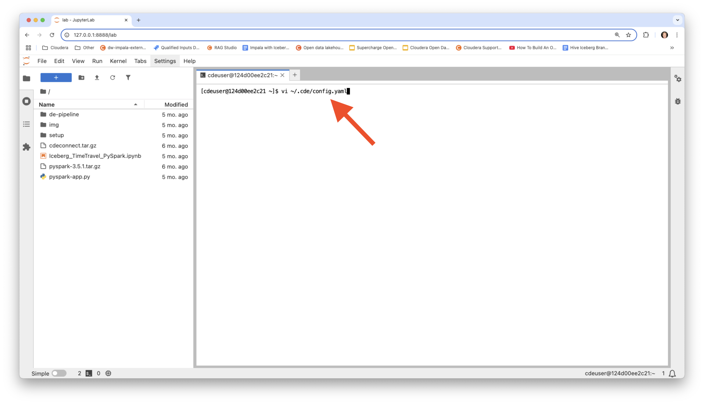
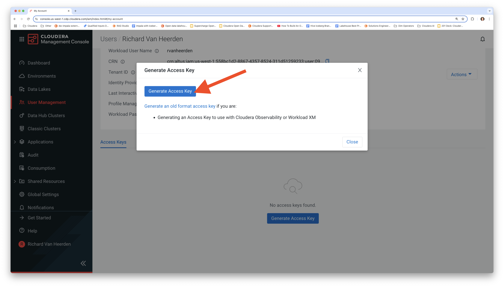

# Spark Application Development in CDE

## Contents

1. [Test jobs with Spark Connect from local](https://github.com/pdefusco/CDE_SparkConnect?tab=readme-ov-file#1-test-jobs-in-cde-session-from-local).  
2. [Once ready for operationalization push to git](https://github.com/pdefusco/CDE_SparkConnect?tab=readme-ov-file#2-push-to-git).
3. [Sync with CDE repository](https://github.com/pdefusco/CDE_SparkConnect?tab=readme-ov-file#3-sync-with-cde-repository)
4. [Deploy using CLI](https://github.com/pdefusco/CDE_SparkConnect?tab=readme-ov-file#4-deploy-using-cli)
5. [Monitor](https://github.com/pdefusco/CDE_SparkConnect?tab=readme-ov-file#5-monitor)

We will prototype and test the Iceberg Merge Into and Incremental Read Operations.

## Instructions

## 1. Test jobs in CDE Session from local

#### Pull the Docker Container and Launch the IDE

Clone the GitHub repository in your local machine.

```
git clone https://github.com/pdefusco/CDE_123_HOL.git
cd CDE_123_HOL
```

Launch the Docker container.

```
docker run -p 8888:8888 pauldefusco/cde123hol
```

Launch the JupyterLab IDE in your browser by copy and pasting the provided url as shown below.


You now have access to all lab materials from the JupyterLab IDE in the left pane. From here, you can launch notebooks and run the terminal.


You will use the terminal in the IDE to run the CDE CLI commands for the labs. First you need to configure the CLI and install Spark Connect though.

#### Configure the CDE CLI and Install Spark Connect for CDE.

Open CDE's configurations and apply your Workload Username and Jobs API URL. You can find your Jobs API URL in your Virtual Cluster's Details Page.





Next, generate a CDP access token and edit your CDP credentials.





Finally, create a Python environment and install the CDE Spark Connect tarballs.

```
pip3 install cdeconnect.tar.gz  
pip3 install pyspark-3.5.1.tar.gz
```


#### Launch a CDE Spark Connect Session

Start a CDE Session of type Spark Connect. Edit the Session Name parameter so it doesn't collide with other users' sessions.

```
cde session create \
  --name paul-hol-session \
  --type spark-connect \
  --num-executors 2 \
  --driver-cores 2 \
  --driver-memory "2g" \
  --executor-cores 2 \
  --executor-memory "2g"
```


In the Sessions UI, validate the Session is Running.


#### Run Your First PySpark & Iceberg Application via Spark Connect

You are now ready to connect to the CDE Session from your local JupyterLab IDE using Spark Connect.

Open Iceberg_TimeTravel_PySpark.ipynb. Update your username and the Storage Location variables and run each cell in the notebook.

```
storageLocation = s3a://cde-hol-buk-d2ab0f50/data/cde-123-hol
username = userXXX
```


#### Prototype the Spark & Iceberg Application as a Spark Submit

On your terminal run the following commands to run your code as a Spark Submit. Make sure to edit the "vcluster-ednpoint" option according to your Virtual Cluster's Jobs API URL.

```
cde spark submit \
  pyspark-app.py \
  --vcluster-endpoint https://274lmxt4.cde-q7kss7bw.cde-hol.vayb-xokg.cloudera.site/dex/api/v1 \
  --executor-memory "4g" \
  --executor-cores 2 \
  s3a://cde-hol-buk-d2ab0f50/data/cde-123-hol
```

Wait for the application to run and validate results in the terminal.


You are now ready to convert the Spark Submit into a CDE Spark Job.

## 3. Sync with CDE repository

CDE Repositories are used to import files and dependencies into Virtual Clusters by cloning git repositories. Create your CDE Repository and sync it with the Git Repository. Make sure to update the name and vcluster-endpoint parameters before executing the CLI commands.

```
cde repository create --name sparkAppRepoDevUser001 \
  --branch main \
  --url https://github.com/pdefusco/CDE_123_HOL.git \
  --vcluster-endpoint https://274lmxt4.cde-q7kss7bw.cde-hol.vayb-xokg.cloudera.site/dex/api/v1

cde repository sync --name sparkAppRepoDevUser001 \
  --vcluster-endpoint https://274lmxt4.cde-q7kss7bw.cde-hol.vayb-xokg.cloudera.site/dex/api/v1
```


## 4. Deploy using CLI

Now create a CDE Spark job using the CDE Repository as a dependency.

The files in the Repository are mounted and reachable by the Application at runtime.

Before executing the CLI commands, update the name, resource, and vcluster endpoint options according to your assigned username.

```
cde job create --name cde_spark_iceberg_job_user001 \
  --type spark \
  --mount-1-resource sparkAppRepoDevUser001 \
  --executor-cores 2 \
  --executor-memory "4g" \
  --application-file pyspark-app.py\
  --vcluster-endpoint https://274lmxt4.cde-q7kss7bw.cde-hol.vayb-xokg.cloudera.site/dex/api/v1 \
  --arg s3a://cde-hol-buk-d2ab0f50/data/cde-123-hol

cde job run --name cde_spark_iceberg_job_user001 \
  --executor-cores 4 \
  --executor-memory "2g" \
  --vcluster-endpoint https://274lmxt4.cde-q7kss7bw.cde-hol.vayb-xokg.cloudera.site/dex/api/v1
```


## 5. Monitor

Navigate to the Job Runs UI / run a few CDE CLI commands to check status.

```
# List all Jobs in the Virtual Cluster:
cde job list \
  --vcluster-endpoint https://274lmxt4.cde-q7kss7bw.cde-hol.vayb-xokg.cloudera.site/dex/api/v1

# List all jobs in the Virtual Cluster whose name is "cde_spark_job_user001":
cde job list \
  --filter 'name[eq]cde_spark_iceberg_job_user001' \
  --vcluster-endpoint https://274lmxt4.cde-q7kss7bw.cde-hol.vayb-xokg.cloudera.site/dex/api/v1

# List all jobs in the Virtual Cluster whose job application file name equals "pyspark-app.py":
cde job list \
  --filter 'spark.file[eq]pyspark-app.py' \
  --vcluster-endpoint https://274lmxt4.cde-q7kss7bw.cde-hol.vayb-xokg.cloudera.site/dex/api/v1

# List all runs for Job "cde_spark_job_user001":
cde run list \
  --filter 'job[eq]cde_spark_iceberg_job_user001' \
  --vcluster-endpoint https://274lmxt4.cde-q7kss7bw.cde-hol.vayb-xokg.cloudera.site/dex/api/v1
```


## Summary and Next Steps

A Spark Connect Session is a type of CDE Session that exposes the Spark Connect interface. A Spark Connect Session allows you to connect to Spark from any remote Python environment.

Spark Connect allows you to connect remotely to the Spark clusters. Spark Connect is an API that uses the DataFrame API and unresolved logical plans as the protocol.

In this article we reviewed an end to end developer framework using Spark Connect, the CDE CLI, and Apache Iceberg. You might also find the following articles and demos relevant:

* [Installing the CDE CLI](https://docs.cloudera.com/data-engineering/cloud/cli-access/topics/cde-cli.html)
* [Simple Introduction to the CDE CLI](https://github.com/pdefusco/CDE_CLI_Simple)
* [CDE Concepts](https://docs.cloudera.com/data-engineering/cloud/cli-access/topics/cde-cli-concepts.html)
* [CDE CLI Command Reference](https://docs.cloudera.com/data-engineering/cloud/cli-access/topics/cde-cli-reference.html)
* [CDE Spark Connect](https://docs.cloudera.com/data-engineering/cloud/spark-connect-sessions/topics/cde-spark-connect-session.html)
* [CDE Jobs API Reference](https://docs.cloudera.com/data-engineering/cloud/jobs-rest-api-reference/index.html)
* [Using Apache Iceberg in CDE](https://docs.cloudera.com/data-engineering/cloud/manage-jobs/topics/cde-using-iceberg.html)
* [How to Create an Apache Iceberg Table in CDE](https://community.cloudera.com/t5/Community-Articles/How-to-Create-an-Iceberg-Table-with-PySpark-in-Cloudera-Data/ta-p/394800)
