# Job Observability & Data Governance in CDP

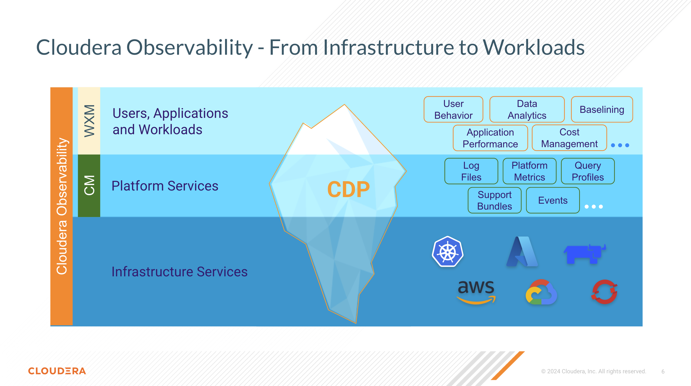

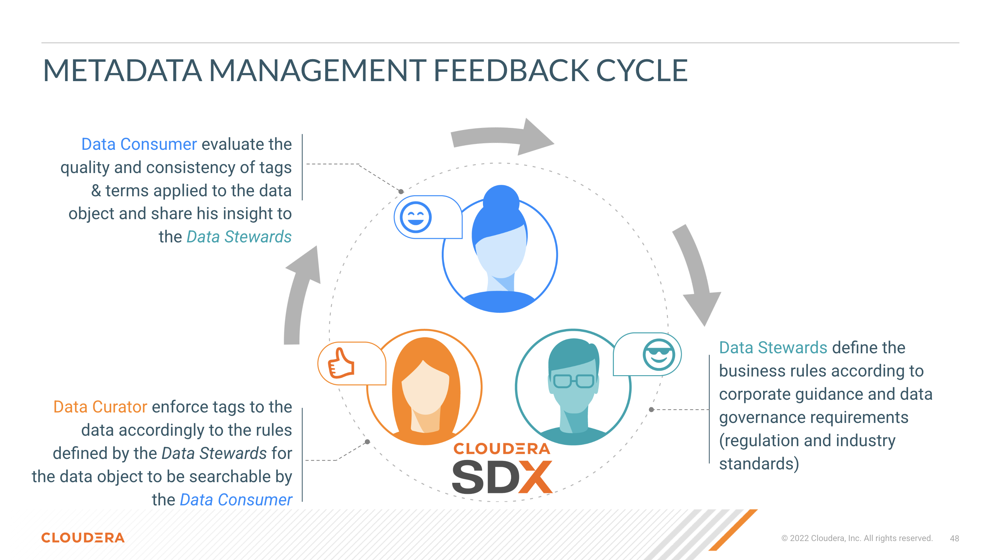

## Contents

5. [Monitor Jobs with Cloudera Observability and CDE](https://github.com/pdefusco/CDE_121_HOL/blob/main/step_by_step_guides/english/part_03_observability.md#lab-5-monitoring-jobs-with-cloudera-observability-and-cde)
6. [Spark Job Governance with CDP Data Catalog](https://github.com/pdefusco/CDE_121_HOL/blob/main/step_by_step_guides/english/part_03_observability.md#lab-6-spark-job-governance-with-cdp-data-catalog)

## Lab 5. Monitoring Jobs with Cloudera Observability and CDE

CDE provides built-in Job observability feature including a Job Runs UI, the Airflow UI, and the ability to download job metadata and logs via the CDE API and CLI. In addition, CDE users can leverage Cloudera Observaibility, a Cloudera service that helps you interactively understand your environment, data services, workloads, clusters, and resources across all compute services in a CDP Environment.

When a workload completes, diagnostic information about the job or query and the cluster that processed them is collected by Telemetry Publisher and sent to Cloudera Observability, so you can optimize your queries and pipelines through:

* A wide range of metrics and health tests that help you identify and troubleshoot both existing and potential issues.
* Prescriptive guidance and recommendations that help you quickly address those problems and optimize solutions.
* Performance baselines and historical analysis that help you identify and address performance problems.

In addition, Cloudera Observability also enables you to:

* Visually display your workload cluster’s current and historical costs that help you plan and forecast budgets, future workload environments, and justify current user groups and resources.
* Trigger actions in real-time across jobs and queries that help you take steps to alleviate potential problems.
* Enable the daily delivery of your cluster statistics to your email address that help you to track, compare, and monitor without having to log in to the cluster.
* Break down your workload metrics into more meaningful views for your business requirements that help you analyze specific workload criteria. For example, you can analyze how queries that access a particular database or that use a specific resource pool are performing against your SLAs. Or you can examine how all the queries are performing on your cluster that are sent by a specific user.

#### Monitor Jobs in CDP Observability

Navigate out of CDE back to the CDP Home Page and then open CDP Observability. Select and expand your Virtual Cluster and then the "Spark" tab.

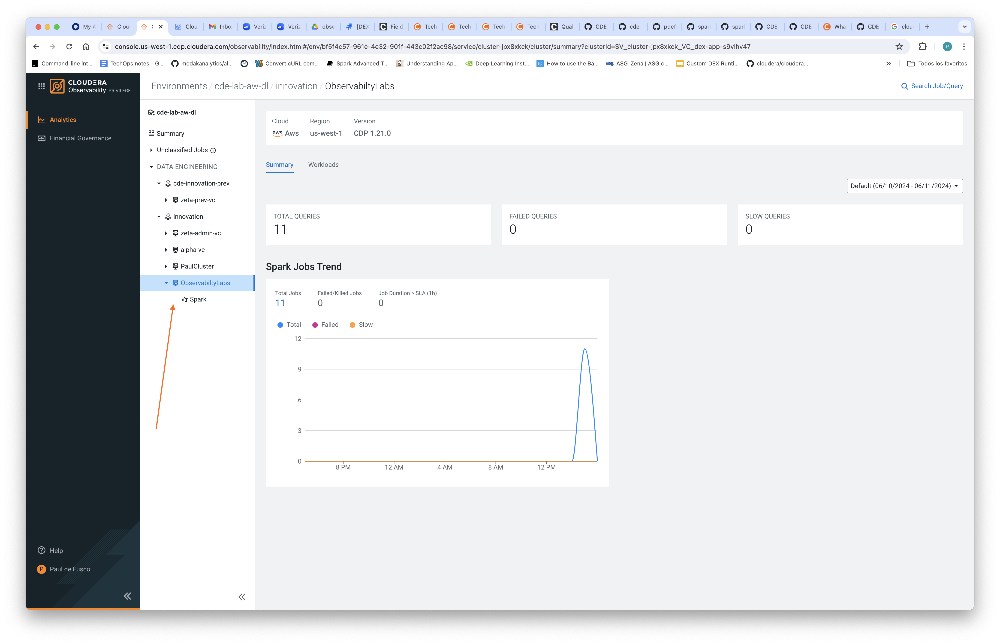

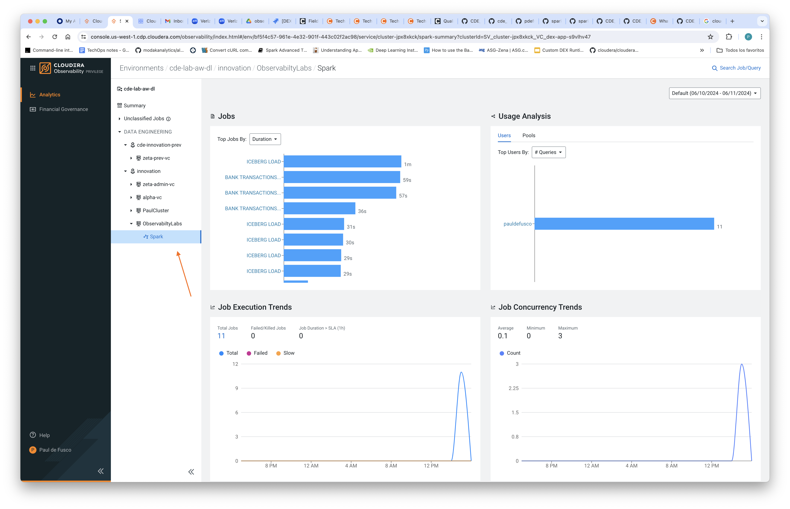

Explore aggregate job trends. Notice that jobs progressively take longer and longer to execute. This is because data is being incrementally loaded into the Iceberg table with a Merge Into operation that operates on a table that is  becoming larger and larger.

Select the job with the highest duration and explore the Execution Details tab to find Spark Job and Stage level information, and the Baseline tab to find granular Spark execution metrics. In the Baseline tab, click on the "Show Abnormal Metrics" icon to identify potential problems with your particular job run.

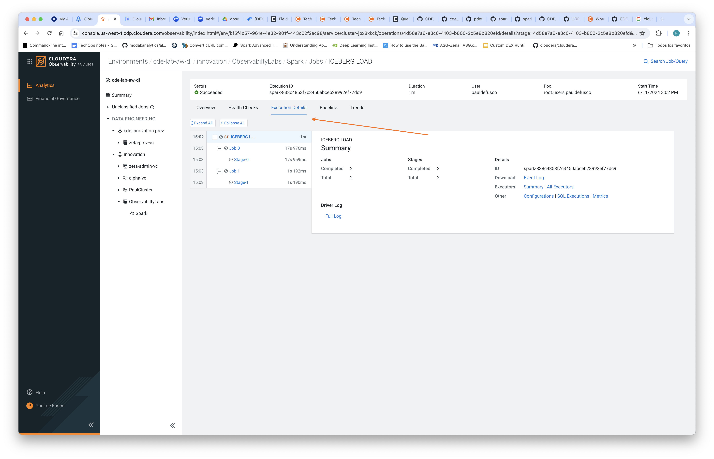

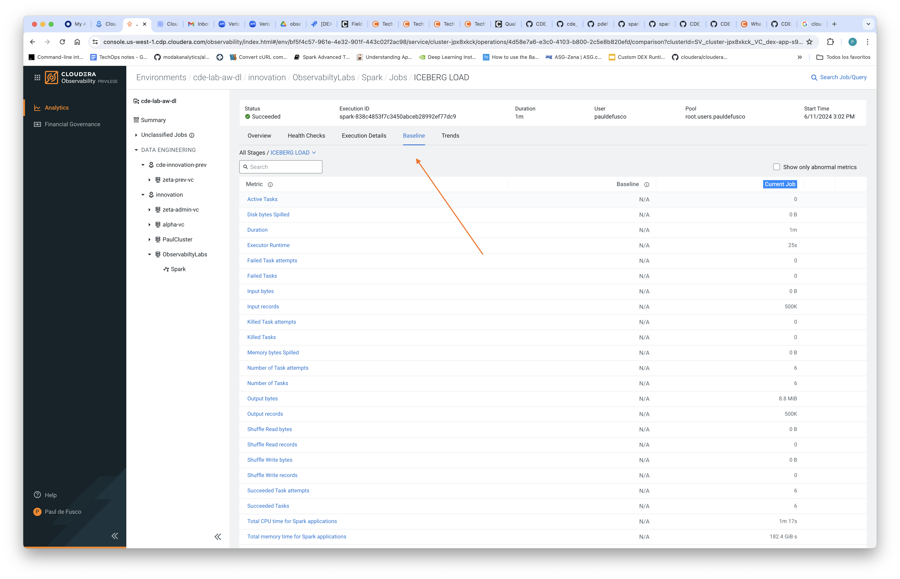

## Lab 6. Spark Job Governance with CDP Data Catalog

The CDP Data Catalog is a service within CDP that enables you to understand, manage, secure, and govern data assets across the enterprise. Data Catalog helps you understand data across multiple clusters and across multiple CDP environments. Using Data Catalog, you can understand how data is interpreted for use, how it is created and modified, and how data access is secured and protected.

#### Explore Jobs in Apache Atlas

Navigate back to the CDP Home Page, open Data Catalog and then Atlas.

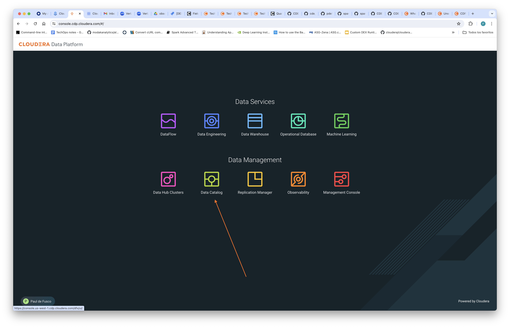

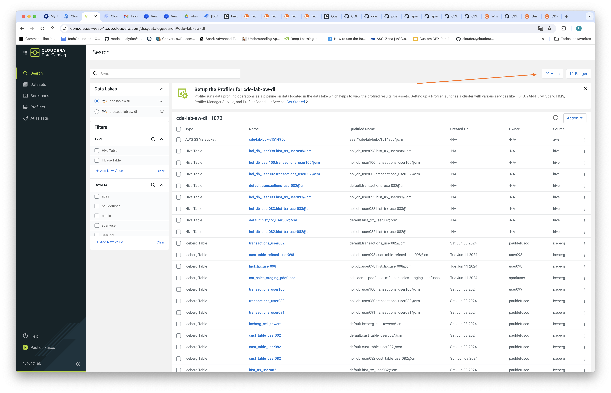

Atlas represents metadata as types and entities, and provides metadata management and governance capabilities for organizations to build, categorize, and govern data assets.

Search for "spark_applications" in the search bar, then select a Spark Application from the list and explore its metadata.

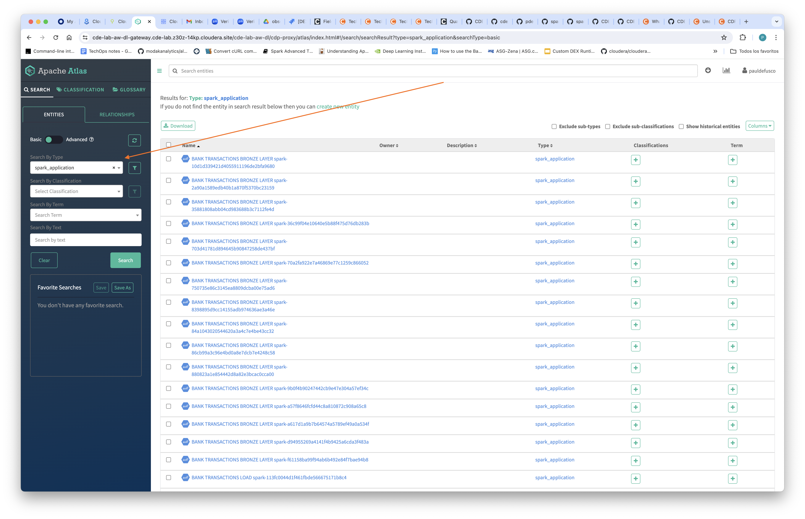

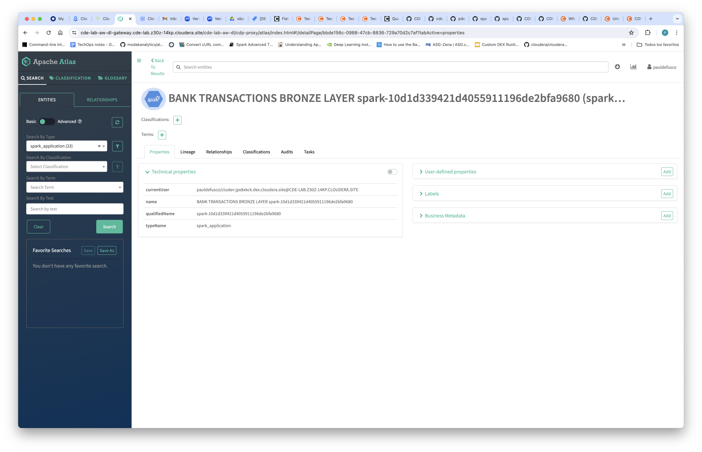

In the Classifications pane, create a new Metadata Classification. Make sure to use a unique Name.

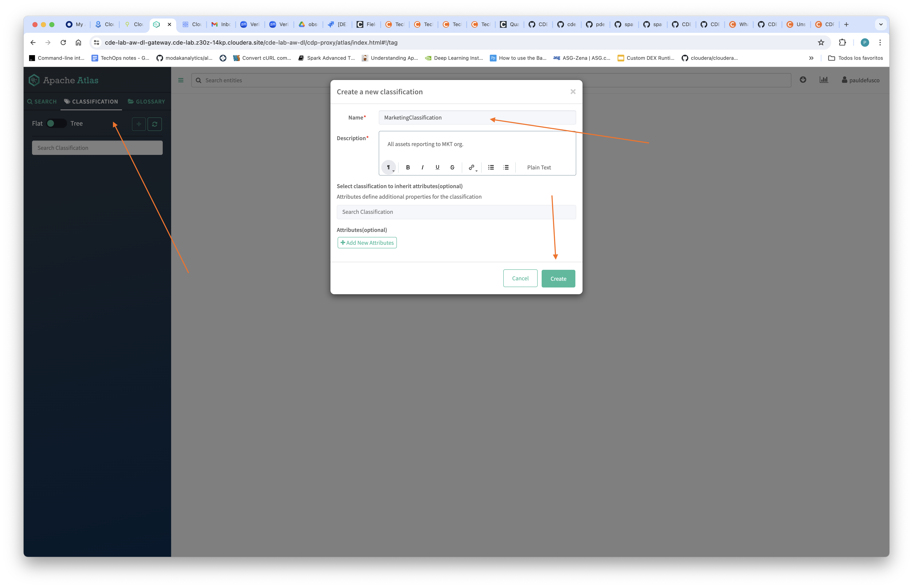

Navigate back to the main page, find a spark application and open it. Then apply the newly created Metadata Classification.

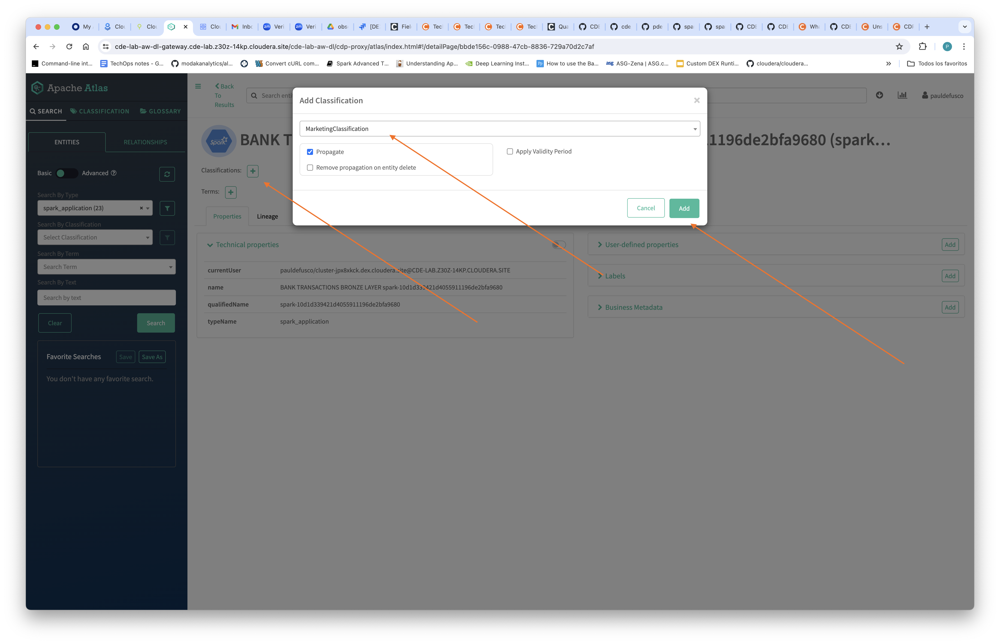

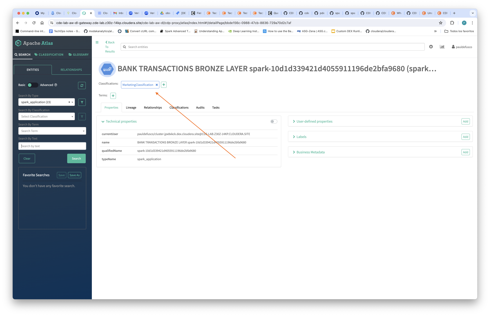

Finally perform a new search, this time using the Classification you created in order to filter for Spark Applications.

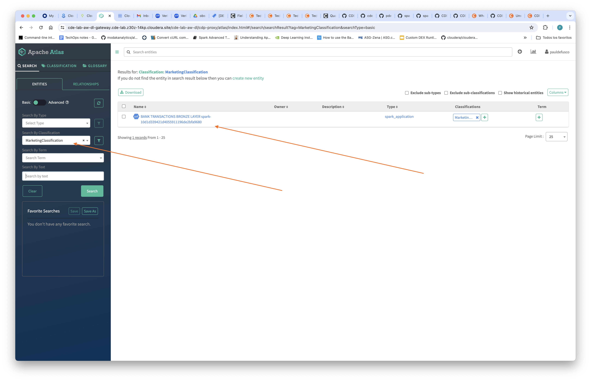

## Summary

Cloudera Observability is CDP’s single pane of glass observability solution, continually discovering and collecting performance telemetry across data, applications, and infrastructure components running in CDP deployments on private and public clouds. With advanced, intelligent analytics and correlations, it provides insights and recommendations to address tricky issues, optimize costs, and improve performance.

CDP Data Catalog is a cloud data catalog is a metadata management service that helps organizations find, manage, and understand their data in the cloud. It's a centralized repository that can help with data-driven decision making, improve data management, and increase operational efficiency

In this final section of the labs you explored Job Run monitoring capabilities in CDE. In particular, you used the CDE Job Runs UI to persist Job Run metadata, Spark Logs and Spark UI post-execution. Then, you used CDP Observability to explore granular Job Run metrics and detect outliers. Finally, you used CDP Data Catalog in order to classify Spark Job runs in order to govern and search important job run metadata.

## Useful Links and Resources

* [Cloudera Observability Documentation](https://docs.cloudera.com/observability/cloud/index.html)
* [CDP Data Catalog](https://docs.cloudera.com/data-catalog/cloud/index.html)
* [Apache Atlas Documentation](https://docs.cloudera.com/cdp-reference-architectures/latest/cdp-ra-security/topics/cdp-ra-security-apache-atlas.html)
* [Apache Ranger Documentation](https://docs.cloudera.com/cdp-reference-architectures/latest/cdp-ra-security/topics/cdp-ra-security-apache-ranger.html)
* [Efficiently Monitoring Jobs, Runs, and Resources with the CDE CLI](https://community.cloudera.com/t5/Community-Articles/Efficiently-Monitoring-Jobs-Runs-and-Resources-with-the-CDE/ta-p/379893)
