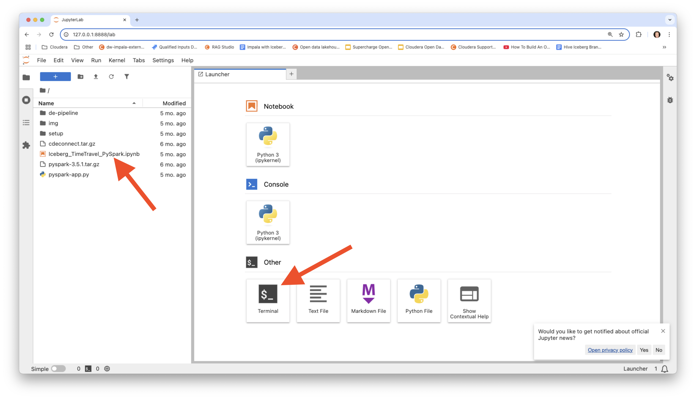
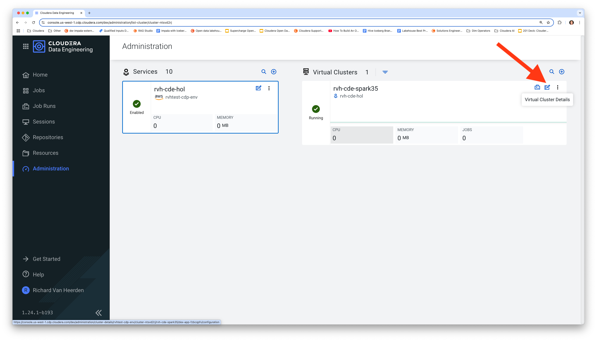
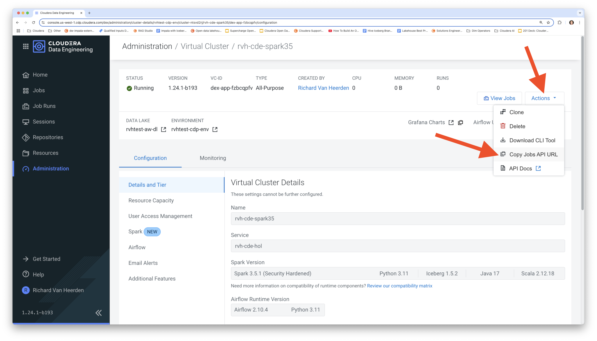
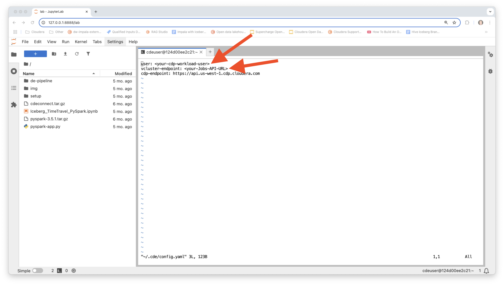
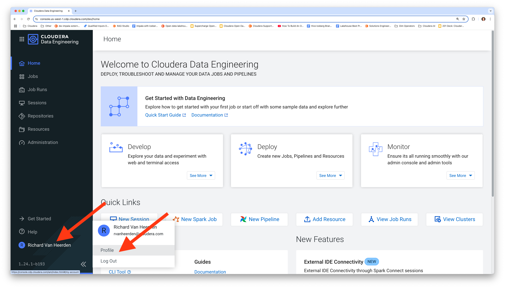
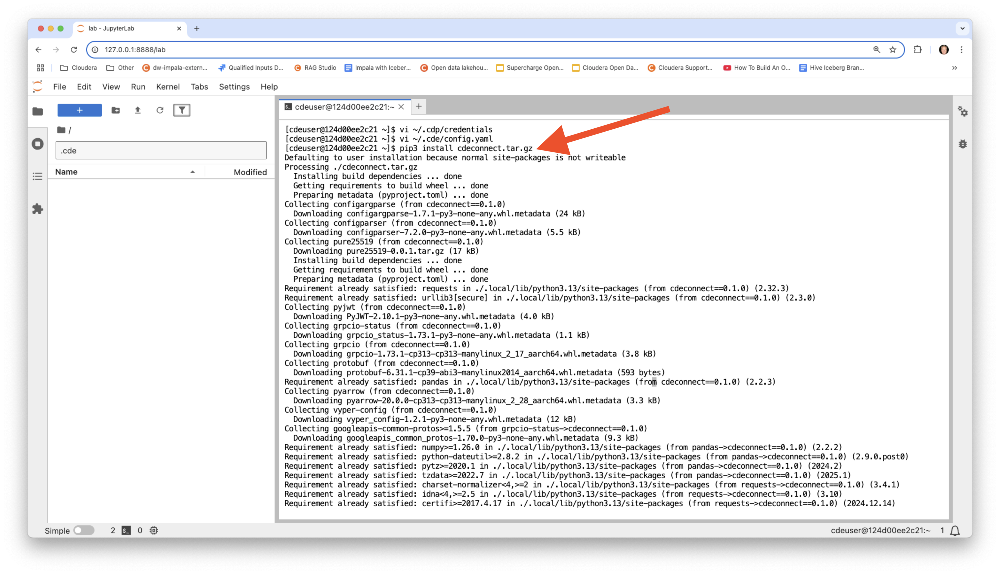

# Desarrollo de Aplicaciones Spark en CDE


## Contenido

1. [Desarrollo de Aplicaciones Spark](https://github.com/pdefusco/CDE_123_HOL/blob/main/step_by_step_guides/english/02-development.md#lab-1-spark-application-development).  
2. [Repositorios, Trabajos y Monitoreo en CDE](https://github.com/pdefusco/CDE_123_HOL/blob/main/step_by_step_guides/english/02-development.md#lab-2-cde-repositories-jobs-and-monitoring).

Prototiparemos y probaremos las operaciones de Iceberg Merge Into y de lectura incremental.

## Laboratorio 1. Desarrollo de Aplicaciones Spark

#### Descargar el Contenedor Docker e Iniciar el IDE

Clona el repositorio de GitHub en tu máquina local.

```
git clone https://github.com/pdefusco/CDE_123_HOL.git
cd CDE_123_HOL
```

Inicia el contenedor Docker.

```
docker run -p 8888:8888 pauldefusco/cde123hol
```

Abre el IDE JupyterLab en tu navegador copiando y pegando la URL proporcionada, como se muestra a continuación.


Ahora tienes acceso a todos los materiales del laboratorio desde el panel izquierdo del IDE JupyterLab. Desde aquí, puedes iniciar notebooks y ejecutar el terminal.



Usarás el terminal del IDE para ejecutar los comandos de la CLI de CDE. Sin embargo, primero necesitas configurar la CLI e instalar Spark Connect.

#### Configurar la CLI de CDE e Instalar Spark Connect para CDE

Abre la configuración de CDE y aplica tu nombre de usuario de Workload y la URL de la API de Jobs. Puedes encontrar la URL de la API de Jobs en la página de detalles de tu Clúster Virtual.








A continuación, genera un token de acceso de CDP y edita tus credenciales de CDP.




Finalmente, crea un entorno Python e instala los paquetes de CDE Spark Connect.

```
pip3 install cdeconnect.tar.gz  
pip3 install pyspark-3.5.1.tar.gz
```



#### Iniciar una Sesión Spark Connect en CDE

Inicia una sesión CDE de tipo Spark Connect. Edita el parámetro de nombre de sesión para evitar conflictos con otras sesiones de usuarios. Se te pedirá tu contraseña de Workload, la misma que usaste para iniciar sesión en CDP.

```
cde session create \
  --name sesion-hol \
  --type spark-connect \
  --num-executors 2 \
  --driver-cores 2 \
  --driver-memory "2g" \
  --executor-cores 2 \
  --executor-memory "2g"
```


En la interfaz de usuario de Sesiones, valida que la sesión esté en ejecución.


#### Ejecutar tu Primera Aplicación PySpark & Iceberg con Spark Connect

Ahora estás listo para conectarte a la sesión de CDE desde tu IDE JupyterLab local usando Spark Connect.

Abre `Iceberg_TimeTravel_PySpark.ipynb`. Actualiza el nombre de la sesión de Spark Connect, el nombre de usuario y la ubicación de almacenamiento en las dos primeras celdas. Luego, ejecuta cada celda del notebook.

```
from cde import CDESparkConnectSession
spark = CDESparkConnectSession.builder.sessionName('<nombre-sesion-spark-connect>').get()
```

```
storageLocation = <ubicacion-almacenamiento>
username = <nombre-usuario-workload>
```


#### Prototipar la Aplicación Spark & Iceberg como un Spark Submit

Ejecuta los siguientes comandos en tu terminal para ejecutar tu código como un Spark Submit. Asegúrate de editar la opción "vcluster-endpoint" de acuerdo con la URL de la API de Jobs de tu Clúster Virtual.

```
cde spark submit \
  pyspark-app.py \
  --vcluster-endpoint <url-api-jobs-vc> \
  --executor-memory "4g" \
  --executor-cores 2 \
  <ubicacion-almacenamiento> \
  <nombre-usuario-workload>
```

Espera a que la aplicación se ejecute y valida los resultados en el terminal.


Ahora estás listo para convertir el Spark Submit en un Trabajo Spark de CDE.

## Laboratorio 2. Repositorios, Trabajos y Monitoreo en CDE

Los Repositorios CDE se usan para importar archivos y dependencias en Clústeres Virtuales clonando repositorios de Git. Crea tu Repositorio CDE y sincronízalo con el Repositorio de Git.

```
cde repository create --name sparkAppRepoDevUser001 \
  --branch main \
  --url https://github.com/pdefusco/CDE_123_HOL.git \
  --vcluster-endpoint <url-api-jobs-vc>
```


#### Desplegar usando CLI

Crea un trabajo Spark de CDE utilizando el repositorio CDE como dependencia.

```
cde job create --name cde_spark_iceberg_job_user001 \
  --type spark \
  --mount-1-resource sparkAppRepoDevUser001 \
  --executor-cores 2 \
  --executor-memory "4g" \
  --application-file pyspark-app.py\
  --vcluster-endpoint <url-api-jobs-vc> \
  --arg <ubicacion-almacenamiento> \
  --arg <nombre-usuario-workload>
```

```
cde job run --name cde_spark_iceberg_job_user001 \
  --executor-cores 4 \
  --executor-memory "2g" \
  --vcluster-endpoint <url-api-jobs-vc>
```


#### Monitor

Navega a la interfaz de Job Runs / ejecuta algunos comandos CDE CLI para verificar el estado.

```
# Listar todos los trabajos en el Clúster Virtual:
cde job list \
  --vcluster-endpoint <tu-URL-de-api-jobs-DEV-vc-aquí>
```


```
# Listar todos los trabajos en el Clúster Virtual cuyo nombre sea "cde_spark_job_user001":
cde job list \
  --filter 'name[eq]cde_spark_iceberg_job_user001' \
  --vcluster-endpoint <tu-URL-de-api-jobs-DEV-vc-aquí>

# Listar todos los trabajos en el Clúster Virtual cuyo nombre de archivo de aplicación de trabajo sea "pyspark-app.py":
cde job list \
  --filter 'spark.file[eq]pyspark-app.py' \
  --vcluster-endpoint <tu-URL-de-api-jobs-DEV-vc-aquí>
```


```
# Listar todas las ejecuciones del Trabajo "cde_spark_job_user001":
cde run list \
  --filter 'job[eq]cde_spark_iceberg_job_user001' \
  --vcluster-endpoint <tu-URL-de-api-jobs-DEV-vc-aquí>
```


## Resumen y Próximos Pasos

Una sesión de Spark Connect es un tipo de sesión CDE que expone la interfaz de Spark Connect. Una sesión de Spark Connect te permite conectar a Spark desde cualquier entorno remoto de Python.

Spark Connect te permite conectarte remotamente a los clústeres de Spark. Spark Connect es una API que utiliza la API de DataFrame y planes lógicos no resueltos como protocolo.

En esta sección de los laboratorios revisamos un marco de trabajo de desarrollo completo utilizando Spark Connect, CDE CLI y Apache Iceberg. También podrían ser relevantes los siguientes artículos y demostraciones:

* [Instalación del CDE CLI](https://docs.cloudera.com/data-engineering/cloud/cli-access/topics/cde-cli.html)
* [Introducción simple al CDE CLI](https://github.com/pdefusco/CDE_CLI_Simple)
* [Conceptos de CDE](https://docs.cloudera.com/data-engineering/cloud/cli-access/topics/cde-cli-concepts.html)
* [Referencia de comandos del CDE CLI](https://docs.cloudera.com/data-engineering/cloud/cli-access/topics/cde-cli-reference.html)
* [CDE Spark Connect](https://docs.cloudera.com/data-engineering/cloud/spark-connect-sessions/topics/cde-spark-connect-session.html)
* [Referencia de API de Jobs de CDE](https://docs.cloudera.com/data-engineering/cloud/jobs-rest-api-reference/index.html)
* [Uso de Apache Iceberg en CDE](https://docs.cloudera.com/data-engineering/cloud/manage-jobs/topics/cde-using-iceberg.html)
* [Cómo crear una tabla Apache Iceberg en CDE](https://community.cloudera.com/t5/Community-Articles/How-to-Create-an-Iceberg-Table-with-PySpark-in-Cloudera-Data/ta-p/394800)
