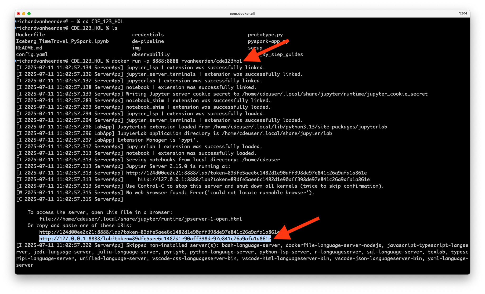

# Développement d'Applications Spark dans CDE


## Contenu

1. [Développement d'Applications Spark](https://github.com/pdefusco/CDE_123_HOL/blob/main/step_by_step_guides/english/02-development.md#lab-1-spark-application-development).
2. [Dépôts CDE, Jobs et Surveillance](https://github.com/pdefusco/CDE_123_HOL/blob/main/step_by_step_guides/english/02-development.md#lab-2-cde-repositories-jobs-and-monitoring).

Nous allons prototyper et tester les opérations de Fusion et de Lecture Incrémentale Iceberg.

## Lab 1. Développement d'Applications Spark

#### Téléchargez le Conteneur Docker et Lancez l'IDE

Clonez le dépôt GitHub sur votre machine locale.

```
git clone https://github.com/pdefusco/CDE_123_HOL.git
cd CDE_123_HOL
```

Lancez le conteneur Docker.

```
docker run -p 8888:8888 pauldefusco/cde123hol
```

Lancez l'IDE JupyterLab dans votre navigateur en copiant et en collant l'URL fournie comme montré ci-dessous.



Vous avez maintenant accès à tout le matériel du laboratoire depuis l'IDE JupyterLab dans le volet gauche. À partir d'ici, vous pouvez lancer des notebooks et exécuter le terminal.


Vous utiliserez le terminal dans l'IDE pour exécuter les commandes CDE CLI pour les laboratoires. Vous devez d'abord configurer la CLI et installer Spark Connect.

#### Configurez la CLI CDE et Installez Spark Connect pour CDE

Ouvrez les configurations de CDE et appliquez votre Nom d'utilisateur Workload et l'URL API des Jobs. Vous pouvez trouver l'URL API de vos Jobs sur la page de détails de votre Virtual Cluster.


Ensuite, générez un jeton d'accès CDP et modifiez vos identifiants CDP.


Enfin, créez un environnement Python et installez les fichiers tarballs CDE Spark Connect.

```
pip3 install cdeconnect.tar.gz  
pip3 install pyspark-3.5.1.tar.gz
```


#### Lancez une Session CDE Spark Connect

Démarrez une Session CDE de type Spark Connect. Modifiez le paramètre du nom de la session pour éviter toute collision avec les sessions d'autres utilisateurs. Vous serez invité à entrer votre mot de passe Workload. C'est le même mot de passe que vous utilisez pour vous connecter à CDP.

```
cde session create \
  --name paul-hol-session \
  --type spark-connect \
  --num-executors 2 \
  --driver-cores 2 \
  --driver-memory "2g" \
  --executor-cores 2 \
  --executor-memory "2g"
```


Dans l'interface Sessions, validez que la session est en cours d'exécution.


#### Exécutez votre Première Application PySpark & Iceberg via Spark Connect

Vous êtes maintenant prêt à vous connecter à la session CDE depuis votre IDE JupyterLab local en utilisant Spark Connect.

Ouvrez Iceberg_TimeTravel_PySpark.ipynb. Mettez à jour le nom de la session Spark Connect, le nom d'utilisateur et les variables de l'emplacement de stockage dans les deux premières cellules. Ensuite, exécutez chaque cellule dans le notebook.

```
from cde import CDESparkConnectSession
spark = CDESparkConnectSession.builder.sessionName('<votre-nom-de-session-spark-connect-ici>').get()
```

```
storageLocation = <votre-emplacement-de-stockage-ici>
username = <votre-nom-utilisateur-cdp-workload-ici>
```


#### Prototypage de l'application Spark & Iceberg sous forme de Spark Submit

Dans votre terminal, exécutez les commandes suivantes pour exécuter votre code sous forme de Spark Submit. Assurez-vous de modifier l'option "vcluster-endpoint" selon l'URL API des Jobs de votre Virtual Cluster.

```
cde spark submit \
  pyspark-app.py \
  --vcluster-endpoint <votre-DEV-vc-jobs-api-url-ici> \
  --executor-memory "4g" \
  --executor-cores 2 \
  <votre-emplacement-de-stockage-ici> \
  <votre-nom-utilisateur-cdp-workload-ici>
```

Par exemple :

```
cde spark submit \
  pyspark-app.py \
  --vcluster-endpoint https://9rqklznh.cde-8qhz2284.pdefusco.a465-9q4k.cloudera.site/dex/api/v1 \
  --executor-memory "4g" \
  --executor-cores 2 \
  s3a://cde-hol-buk-d2ab0f50/data/cde-123-hol \
  user001
```

Attendez que l'application s'exécute et validez les résultats dans le terminal.


Vous êtes maintenant prêt à convertir le Spark Submit en un Job Spark CDE.

## Lab 2. Dépôts CDE, Jobs et Surveillance

Les dépôts CDE sont utilisés pour importer des fichiers et des dépendances dans des Virtual Clusters en clonant des dépôts git. Créez votre dépôt CDE et synchronisez-le avec le dépôt Git. Assurez-vous de mettre à jour les paramètres de nom et de vcluster-endpoint avant d'exécuter les commandes CLI.

```
cde repository create --name sparkAppRepoDevUser001 \
  --branch main \
  --url https://github.com/pdefusco/CDE_123_HOL.git \
  --vcluster-endpoint <votre-DEV-vc-jobs-api-url-ici>

cde repository sync --name sparkAppRepoDevUser001 \
  --vcluster-endpoint <votre-DEV-vc-jobs-api-url-ici>
```


#### Déploiement via CLI

Créez maintenant un job Spark CDE en utilisant le dépôt CDE comme dépendance.

Les fichiers du dépôt sont montés et accessibles par l'application lors de l'exécution.

Avant d'exécuter les commandes CLI, mettez à jour les options de nom, de ressource et de vcluster-endpoint en fonction de votre nom d'utilisateur attribué.

```
cde job create --name cde_spark_iceberg_job_user001 \
  --type spark \
  --mount-1-resource sparkAppRepoDevUser001 \
  --executor-cores 2 \
  --executor-memory "4g" \
  --application-file pyspark-app.py\
  --vcluster-endpoint <votre-DEV-vc-jobs-api-url-ici> \
  --arg <votre-emplacement-de-stockage-ici> \
  --arg <votre-nom-utilisateur-cdp-workload-ici>
```

```
cde job run --name cde_spark_iceberg_job_user001 \
  --executor-cores 4 \
  --executor-memory "2g" \
  --vcluster-endpoint <votre-DEV-vc-jobs-api-url-ici>
```


#### Surveillance

Accédez à l'interface Job Runs / exécutez quelques commandes CDE CLI pour vérifier l'état.

```
# Listez tous les jobs dans le Virtual Cluster :
cde job list \
  --vcluster-endpoint <votre-DEV-vc-jobs-api-url-ici>
```


```
# Listez tous les jobs dans le Virtual Cluster dont le nom est "cde_spark_job_user001" :
cde job list \
  --filter 'name[eq]cde_spark_iceberg_job_user001' \
  --vcluster-endpoint <votre-DEV-vc-jobs-api-url-ici>

# Listez tous les jobs dans le Virtual Cluster dont le nom du fichier de l'application

 est "pyspark-app.py" :
cde job list \
  --filter 'spark.file[eq]pyspark-app.py' \
  --vcluster-endpoint <votre-DEV-vc-jobs-api-url-ici>
```


```
# Listez toutes les exécutions du Job "cde_spark_job_user001" :
cde run list \
  --filter 'job[eq]cde_spark_iceberg_job_user001' \
  --vcluster-endpoint <votre-DEV-vc-jobs-api-url-ici>
```


## Résumé et Prochaines Étapes

Une Session Spark Connect est un type de Session CDE qui expose l'interface Spark Connect. Une Session Spark Connect vous permet de vous connecter à Spark depuis n'importe quel environnement Python distant.

Spark Connect permet de se connecter à distance aux clusters Spark. Spark Connect est une API qui utilise l'API DataFrame et les plans logiques non résolus comme protocole.

Dans cette section des laboratoires, nous avons examiné un cadre de développement de bout en bout utilisant Spark Connect, la CLI CDE et Apache Iceberg. Vous pourriez également trouver les articles et démos suivants pertinents :

* [Installer la CLI CDE](https://docs.cloudera.com/data-engineering/cloud/cli-access/topics/cde-cli.html)
* [Introduction Simple à la CLI CDE](https://github.com/pdefusco/CDE_CLI_Simple)
* [Concepts CDE](https://docs.cloudera.com/data-engineering/cloud/cli-access/topics/cde-cli-concepts.html)
* [Référence des Commandes CDE CLI](https://docs.cloudera.com/data-engineering/cloud/cli-access/topics/cde-cli-reference.html)
* [CDE Spark Connect](https://docs.cloudera.com/data-engineering/cloud/spark-connect-sessions/topics/cde-spark-connect-session.html)
* [Référence API des Jobs CDE](https://docs.cloudera.com/data-engineering/cloud/jobs-rest-api-reference/index.html)
* [Utiliser Apache Iceberg dans CDE](https://docs.cloudera.com/data-engineering/cloud/manage-jobs/topics/cde-using-iceberg.html)
* [Comment Créer une Table Apache Iceberg dans CDE](https://community.cloudera.com/t5/Community-Articles/How-to-Create-an-Iceberg-Table-with-PySpark-in-Cloudera-Data/ta-p/394800)
