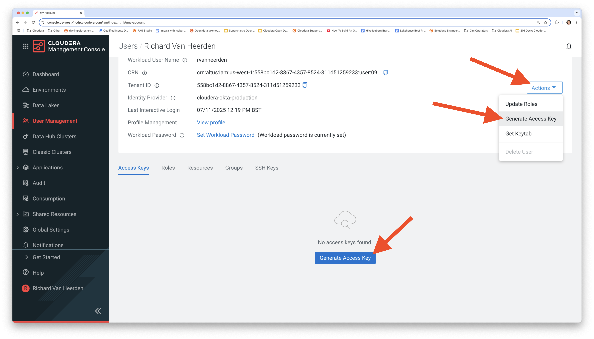
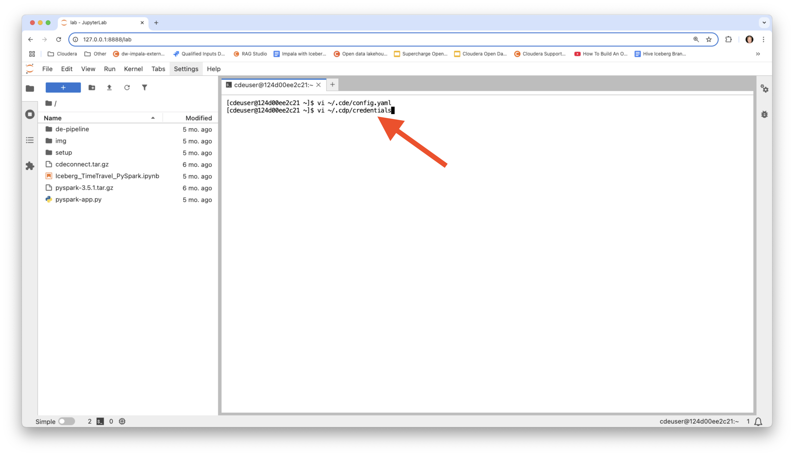

# Desenvolvimento de Aplicações Spark no CDE


## Conteúdo

1. [Desenvolvimento de Aplicações Spark](https://github.com/pdefusco/CDE_123_HOL/blob/main/step_by_step_guides/english/02-development.md#lab-1-spark-application-development).  
2. [Repositórios CDE, Jobs e Monitoramento](https://github.com/pdefusco/CDE_123_HOL/blob/main/step_by_step_guides/english/02-development.md#lab-2-cde-repositories-jobs-and-monitoring).

Vamos prototipar e testar as operações Iceberg Merge Into e Incremental Read.

## Lab 1. Desenvolvimento de Aplicação Spark

#### Baixar o Container Docker e Iniciar o IDE

Clone o repositório do GitHub em sua máquina local.

```
git clone https://github.com/pdefusco/CDE_123_HOL.git
cd CDE_123_HOL
```

Inicie o container Docker.

```
docker run -p 8888:8888 pauldefusco/cde123hol
```

Inicie o JupyterLab IDE no seu navegador, copiando e colando a URL fornecida, conforme mostrado abaixo.


Agora você tem acesso a todo o material do laboratório através do JupyterLab IDE no painel esquerdo. A partir daqui, você pode iniciar notebooks e executar o terminal.


Você usará o terminal no IDE para executar os comandos CDE CLI para os laboratórios. No entanto, primeiro, você precisa configurar o CLI e instalar o Spark Connect.

#### Configurar o CDE CLI e Instalar o Spark Connect para o CDE.

Abra as configurações do CDE e aplique o seu Nome de Usuário de Workload e a URL da API de Jobs. Você pode encontrar a URL da API de Jobs na página de Detalhes do seu Virtual Cluster.


Em seguida, gere um token de acesso CDP e edite suas credenciais CDP.







Por fim, crie um ambiente Python e instale os pacotes do CDE Spark Connect.

```
pip3 install cdeconnect.tar.gz  
pip3 install pyspark-3.5.1.tar.gz
```


#### Iniciar uma Sessão CDE Spark Connect

Inicie uma Sessão CDE do tipo Spark Connect. Edite o parâmetro do Nome da Sessão para evitar conflito com as sessões de outros usuários. Você será solicitado a inserir sua Senha de Workload. Esta é a mesma senha que você usou para fazer login no CDP.

```
cde session create \
  --name paul-hol-session \
  --type spark-connect \
  --num-executors 2 \
  --driver-cores 2 \
  --driver-memory "2g" \
  --executor-cores 2 \
  --executor-memory "2g"
```


Na interface de Sessões, valide se a Sessão está em execução.


#### Executar Seu Primeiro Aplicativo PySpark & Iceberg via Spark Connect

Agora você está pronto para se conectar à Sessão CDE a partir do seu IDE local JupyterLab usando o Spark Connect.

Abra o Iceberg_TimeTravel_PySpark.ipynb. Atualize o nome da sessão Spark Connect, o nome de usuário e as variáveis de Localização de Armazenamento nas duas primeiras células. Em seguida, execute cada célula do notebook.

```
from cde import CDESparkConnectSession
spark = CDESparkConnectSession.builder.sessionName('<your-spark-connect-session-name-here>').get()
```

```
storageLocation = <your-storage-location-here>
username = <your-cdp-workload-username-here>
```


#### Prototipar a Aplicação Spark & Iceberg como Spark Submit

No terminal, execute os seguintes comandos para rodar seu código como Spark Submit. Certifique-se de editar a opção "vcluster-endpoint" de acordo com a URL da API de Jobs do seu Virtual Cluster.

```
cde spark submit \
  pyspark-app.py \
  --vcluster-endpoint <your-DEV-vc-jobs-api-url-here> \
  --executor-memory "4g" \
  --executor-cores 2 \
  <your-storage-location-here> \
  <your-cdp-workload-username-here>
```

Exemplo:

```
cde spark submit \
  pyspark-app.py \
  --vcluster-endpoint https://9rqklznh.cde-8qhz2284.pdefusco.a465-9q4k.cloudera.site/dex/api/v1 \
  --executor-memory "4g" \
  --executor-cores 2 \
  s3a://cde-hol-buk-d2ab0f50/data/cde-123-hol \
  user001
```

Aguarde a execução do aplicativo e valide os resultados no terminal.


Agora você está pronto para converter o Spark Submit em um Job CDE Spark.

## Lab 2. Repositórios CDE, Jobs e Monitoramento

Repositórios CDE são usados para importar arquivos e dependências para os Virtual Clusters ao clonar repositórios git. Crie seu Repositório CDE e sincronize-o com o Repositório Git. Certifique-se de atualizar o nome e os parâmetros de vcluster-endpoint antes de executar os comandos CLI.

```
cde repository create --name sparkAppRepoDevUser001 \
  --branch main \
  --url https://github.com/pdefusco/CDE_123_HOL.git \
  --vcluster-endpoint <your-DEV-vc-jobs-api-url-here>

cde repository sync --name sparkAppRepoDevUser001 \
  --vcluster-endpoint <your-DEV-vc-jobs-api-url-here>
```


#### Deploy usando CLI

Agora crie um job CDE Spark usando o Repositório CDE como dependência.

Os arquivos no Repositório são montados e acessíveis pela Aplicação em tempo de execução.

Antes de executar os comandos CLI, atualize as opções de nome, recurso e vcluster endpoint de acordo com seu nome de usuário atribuído.

```
cde job create --name cde_spark_iceberg_job_user001 \
  --type spark \
  --mount-1-resource sparkAppRepoDevUser001 \
  --executor-cores 2 \
  --executor-memory "4g" \
  --application-file pyspark-app.py\
  --vcluster-endpoint <your-DEV-vc-jobs-api-url-here> \
  --arg <your-storage-location-here> \
  --arg <your-cdp-workload-username-here>
```

```
cde job run --name cde_spark_iceberg_job_user001 \
  --executor-cores 4 \
  --executor-memory "2g" \
  --vcluster-endpoint <your-DEV-vc-jobs-api-url-here>
```


#### Monitorar

Navegue para a interface de Execuções de Jobs / execute alguns comandos CDE CLI para verificar o status.

```
# Listar todos os Jobs no Virtual Cluster:
cde job list \
  --vcluster-endpoint <your-DEV-vc-jobs-api-url-here>
```


```
# Listar todos os jobs no Virtual Cluster cujo nome seja "cde_spark_job_user001":
cde job list \
  --filter 'name[eq]cde_spark_iceberg_job_user001' \
  --vcluster-endpoint <your-DEV-vc-jobs-api-url-here>

# Listar todos os jobs no Virtual Cluster cujo nome do arquivo da aplicação seja "pyspark-app.py":
cde job list \
  --filter 'spark.file[eq]pyspark-app.py' \
  --vcluster-endpoint <your-DEV-vc-jobs-api-url-here>
```


```
# Listar todas as execuções do Job "cde_spark_job_user001":
cde run list \
  --filter 'job[eq]cde_spark_iceberg_job_user001' \
  --vcluster-endpoint <your-DEV-vc-jobs-api-url-here>
```


## Resumo e Próximos Passos

Uma Sessão Spark Connect é um tipo de Sessão CDE que expõe a interface Spark Connect. Uma Sessão Spark Connect permite conectar-se ao Spark a partir de qualquer ambiente Python remoto.

Spark Connect permite que você se conecte remotamente aos clusters Spark. Spark Connect é uma API que usa a API DataFrame e planos lógicos não resolvidos como protocolo.

Nesta seção dos laboratórios, revisamos uma estrutura de desenvolvedor de ponta a ponta usando Spark Connect, o CDE CLI e o Apache Iceberg. Você também pode achar os seguintes artigos e demonstrações relevantes:

* [Instalando o CDE CLI](https://docs.cloudera.com/data-engineering/cloud/cli-access/topics/cde-cli.html)
* [Introdução Simples ao CDE CLI](https://github.com/pdefusco/CDE_CLI_Simple)
* [Conceitos CDE](https://docs.cloudera.com/data-engineering/cloud/cli-access/topics/cde-cli-concepts.html)
* [Referência de Comandos CDE CLI](https://docs.cloudera.com/data-engineering/cloud/cli-access/topics/cde-cli-reference.html)
* [CDE Spark Connect](https://docs.cloudera.com/data-engineering/cloud/spark-connect-sessions/topics/cde-spark-connect-session.html)
* [Referência da API de Jobs CDE](https://docs.cloudera.com/data-engineering/cloud/jobs-rest-api-reference/index.html)
* [Usando o Apache Iceberg no CDE](https://docs.cloudera.com/data-engineering/cloud/manage-jobs/topics/cde-using-iceberg.html)
* [Como Criar uma Tabela Apache Iceberg no CDE](https://community.cloudera.com/t5/Community-Articles/How-to-Create-an-Iceberg-Table-with-PySpark-in-Cloudera-Data/ta-p/394800)
