# Observabilidade de Jobs & Governança de Dados no CDP

## Conteúdo

5. [Monitorar Jobs com Cloudera Observability e CDE](https://github.com/pdefusco/CDE_121_HOL/blob/main/step_by_step_guides/english/part_03_observability.md#lab-5-monitoring-jobs-with-cloudera-observability-and-cde)
6. [Governança de Jobs Spark com o CDP Data Catalog](https://github.com/pdefusco/CDE_121_HOL/blob/main/step_by_step_guides/english/part_03_observability.md#lab-6-spark-job-governance-with-cdp-data-catalog)

## Lab 5. Monitorando Jobs com Cloudera Observability e CDE

O CDE oferece um recurso integrado de observabilidade de Jobs, incluindo uma interface de Jobs Runs UI, a interface do Airflow, e a capacidade de baixar os metadados e logs dos jobs através da API e CLI do CDE. Além disso, os usuários do CDE podem utilizar o Cloudera Observability, um serviço da Cloudera que ajuda a entender interativamente seu ambiente, serviços de dados, cargas de trabalho, clusters e recursos em todos os serviços de computação em um Ambiente CDP.

Quando uma carga de trabalho é concluída, as informações diagnósticas sobre o job ou consulta e o cluster que os processou são coletadas pelo Telemetry Publisher e enviadas para o Cloudera Observability, para que você possa otimizar suas consultas e pipelines através de:

* Uma ampla gama de métricas e testes de saúde que ajudam a identificar e solucionar problemas existentes e potenciais.
* Orientações prescritivas e recomendações que ajudam a resolver rapidamente esses problemas e otimizar soluções.
* Linhas de base de desempenho e análise histórica que ajudam a identificar e resolver problemas de desempenho.

Além disso, o Cloudera Observability também permite que você:

* Exiba visualmente os custos atuais e históricos do seu cluster de carga de trabalho, ajudando a planejar e prever orçamentos, ambientes futuros de carga de trabalho e justificar grupos de usuários e recursos atuais.
* Acione ações em tempo real em jobs e consultas que ajudam a tomar medidas para aliviar problemas potenciais.
* Habilite a entrega diária das estatísticas do seu cluster para o seu endereço de e-mail, ajudando a rastrear, comparar e monitorar sem precisar fazer login no cluster.
* Divida as métricas de sua carga de trabalho em visualizações mais significativas para os requisitos do seu negócio, ajudando a analisar critérios específicos de carga de trabalho. Por exemplo, você pode analisar como as consultas que acessam um banco de dados específico ou que utilizam um pool de recursos específico estão se saindo em relação aos seus SLAs. Ou você pode examinar como todas as consultas estão sendo executadas em seu cluster enviadas por um usuário específico.

#### Identificar a causa de Jobs Spark no CDE mais lentos que o habitual no CDP Observability

Navegue de volta para a página inicial do CDP e abra o CDP Observability. Selecione e expanda o Virtual Cluster Org1 e depois a guia "Spark". Procure o aplicativo Spark "LargeShuffleExample" e identifique jobs que estão levando mais tempo do que o habitual. Com que frequência o job está sendo executado mais lentamente do que o habitual?

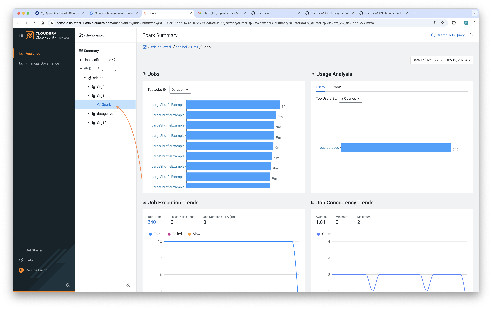

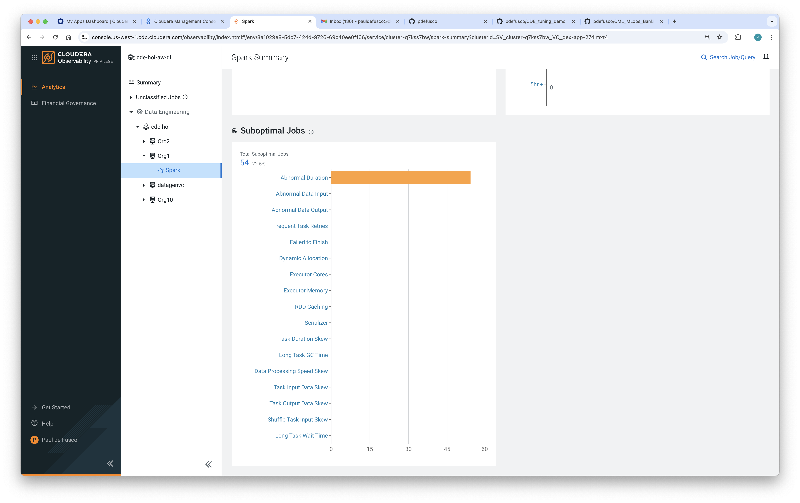

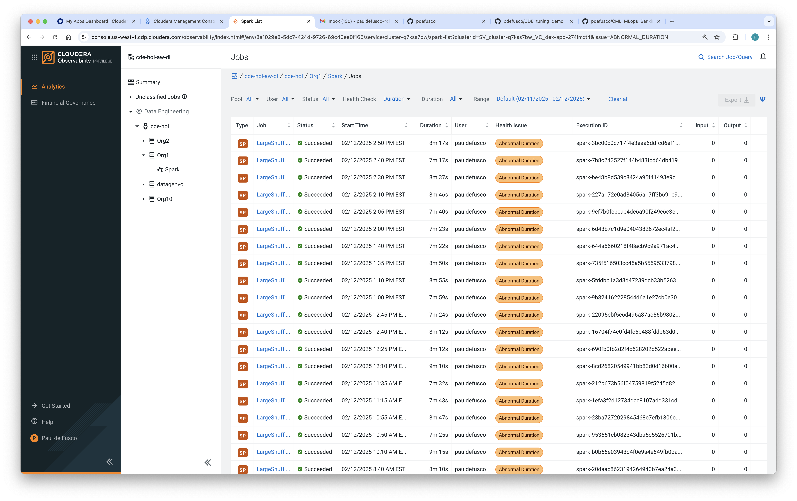

Selecione a execução do job com a maior duração e explore a guia Detalhes de Execução para encontrar informações detalhadas do Job Spark e nível de Stage, e a guia Baseline para encontrar métricas detalhadas de execução do Spark. Na guia Baseline, clique no ícone "Mostrar Métricas Anormais" para identificar problemas potenciais com a execução específica do seu job.

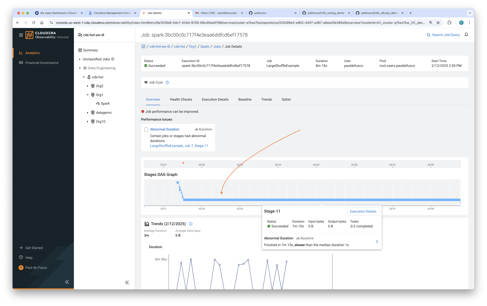

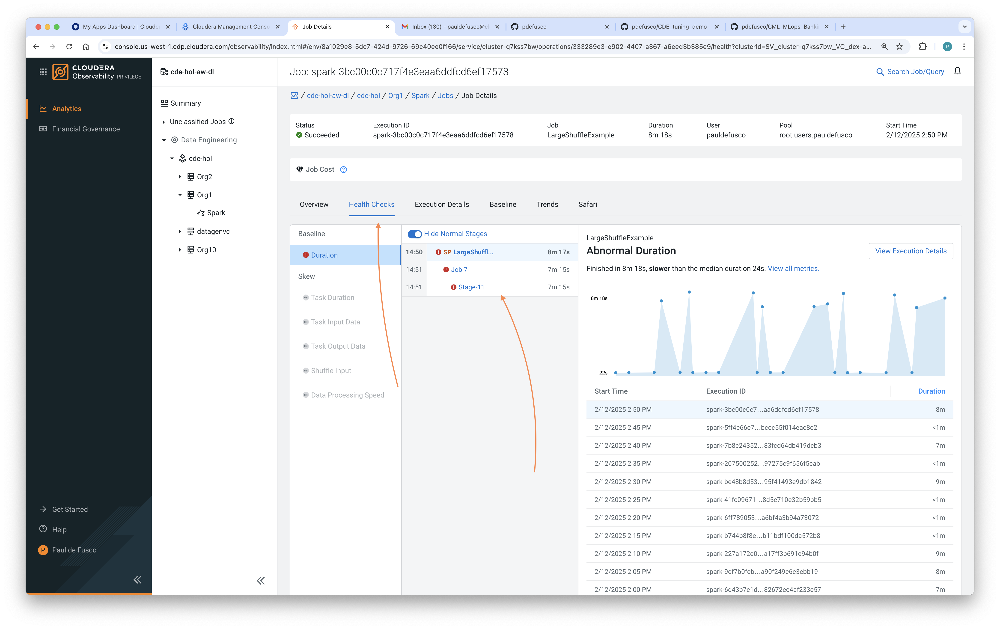

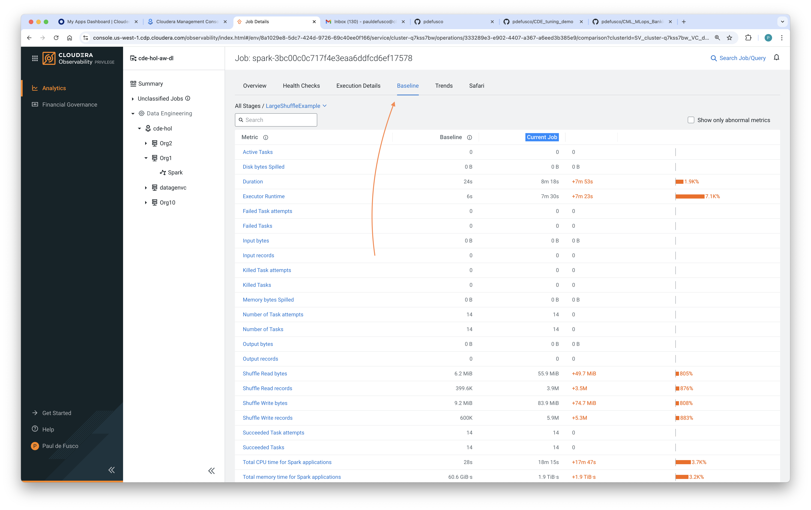

Ao inspecionar as métricas da execução atual e comparar com a linha de base, parece que cerca de 20% do tempo o aplicativo está realizando um Spark Shuffle anômalo. Em seguida, abra o código do aplicativo Spark e tente identificar o motivo disso. O código está localizado em ["observability/skewApp.py"](https://github.com/pdefusco/CDE_123_HOL/blob/main/observability/skewApp.py)

#### Identificar a causa de um Job Spark falho no CDE no CDP Observability

Agora, altere para o Virtual Cluster Org2 no Observability e abra a visão de falhas de jobs. Identifique uma execução falha do job "ObsDemo" e explore o rastreamento de erro.

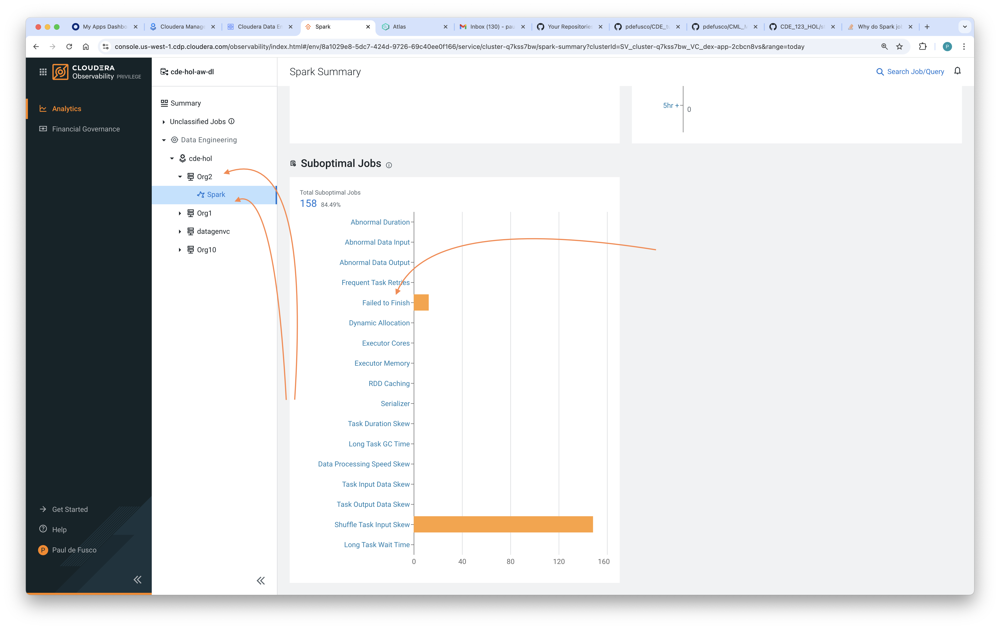

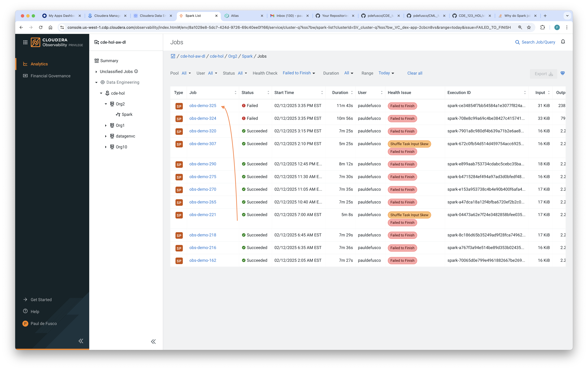

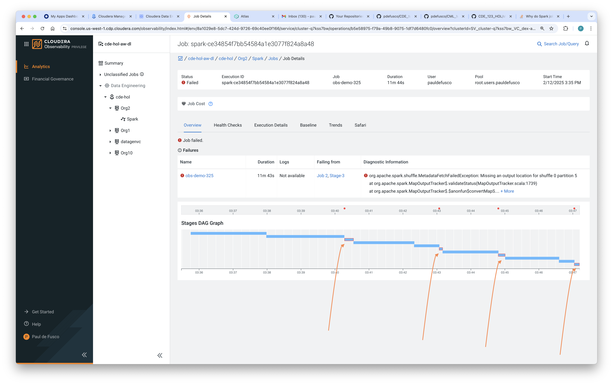

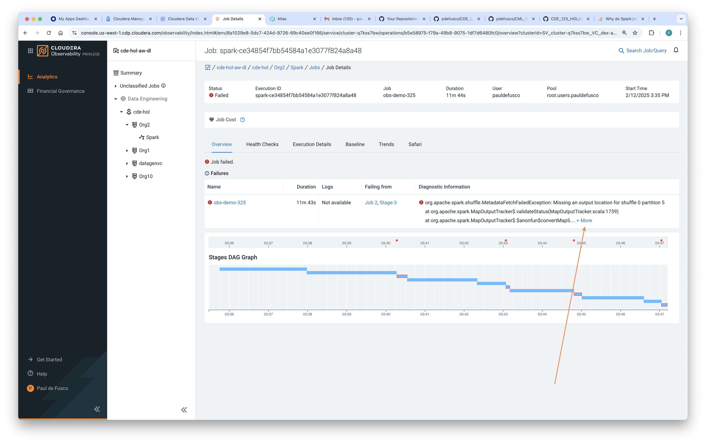

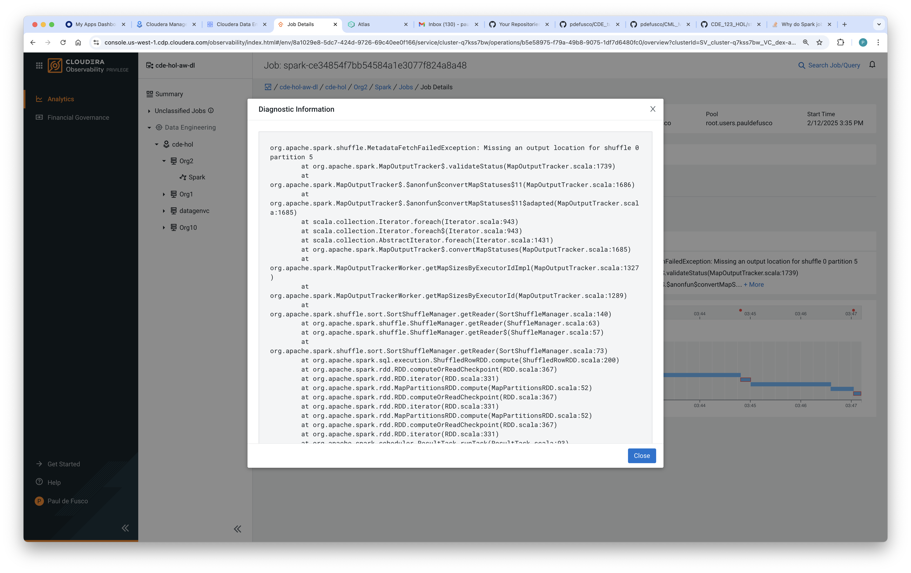

Parece que seu Job Spark falhou devido à falta de recursos. Em particular, uma de suas partições tem dados demais devido ao skew. Para reiniciar o job com sucesso, você pode aumentar a memória do Spark Executor e os núcleos, ou pode melhorar o código para lidar melhor com o skew de dados.

## Lab 6. Governança de Jobs Spark com CDP Data Catalog

O CDP Data Catalog é um serviço dentro do CDP que permite entender, gerenciar, proteger e governar os ativos de dados em toda a empresa. O Data Catalog ajuda a entender os dados em vários clusters e ambientes do CDP. Usando o Data Catalog, você pode entender como os dados são interpretados para uso, como são criados e modificados, e como o acesso aos dados é protegido e seguro.

#### Explorar Jobs no Apache Atlas

Navegue de volta para a página inicial do CDP, abra o Data Catalog e depois o Atlas.

O Atlas representa metadados como tipos e entidades e fornece recursos de gerenciamento de metadados e governança para organizações construírem, categorizarem e governarem ativos de dados.

Pesquise por "spark_applications" na barra de pesquisa, depois selecione um Aplicativo Spark da lista e explore seus metadados.

No painel de Classificações, crie uma nova Classificação de Metadados. Certifique-se de usar um Nome único.

Navegue de volta para a página principal, encontre um aplicativo Spark e abra-o. Em seguida, aplique a Classificação de Metadados recém-criada.

Por fim, faça uma nova pesquisa, desta vez utilizando a Classificação que você criou para filtrar por Aplicativos Spark.

## Resumo

O Cloudera Observability é a solução de observabilidade de painel único do CDP, descobrindo e coletando continuamente telemetria de desempenho em dados, aplicativos e componentes de infraestrutura que estão sendo executados em implementações CDP em nuvens privadas e públicas. Com análises avançadas e inteligentes e correlações, fornece insights e recomendações para resolver problemas complexos, otimizar custos e melhorar o desempenho.

O CDP Data Catalog é um serviço de catálogo de dados em nuvem que ajuda as organizações a encontrar, gerenciar e entender seus dados na nuvem. É um repositório centralizado que pode ajudar na tomada de decisões orientadas por dados, melhorar o gerenciamento de dados e aumentar a eficiência operacional.

Nesta última seção dos labs, você explorou as capacidades de monitoramento de Execuções de Jobs no CDE. Em particular, você usou a interface CDE Job Runs UI para persistir metadados das Execuções de Jobs, Logs do Spark e a interface Spark UI pós-execução. Depois, você utilizou o CDP Observability para explorar métricas detalhadas de Execuções de Jobs e detectar anomalias. Finalmente, você usou o CDP Data Catalog para classificar execuções de Jobs Spark, governar e pesquisar metadados importantes de execuções de jobs.

## Links e Recursos Úteis

* [Documentação do Cloudera Observability](https://docs.cloudera.com/observability/cloud/index.html)
* [CDP Data Catalog](https://docs.cloudera.com/data-catalog/cloud/index.html)
* [Documentação do Apache Atlas](https://docs.cloudera.com/cdp-reference-architectures/latest/cdp-ra-security/topics/cdp-ra-security-apache-atlas.html)
* [Documentação do Apache Ranger](https://docs.cloudera.com/cdp-reference-architectures/latest/cdp-ra-security/topics/cdp-ra-security-apache-ranger.html)
* [Monitorando de forma eficiente Jobs, Execuções e Recursos com a CLI do CDE](https://community.cloudera.com/t5/Community-Articles/Efficiently-Monitoring-Jobs-Runs-and-Resources-with-the-CDE/ta-p/379893)
